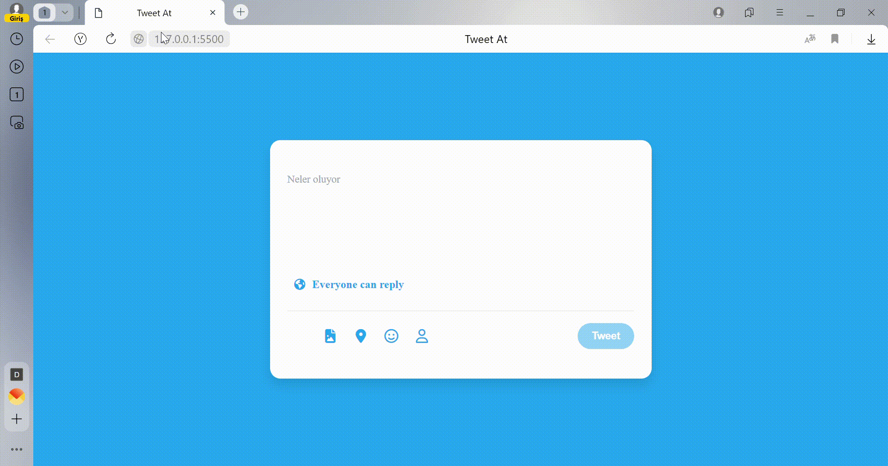

1-Twitter Tweet ekleme alanı tasarımı yapılacak

2-Input focus olduğunda renk değişecek
3-Inputta klavye girişi olduğunda placeholde gidece
3-alt kısımda bir sayaç açılacak
5-Kalan karakter limitini tutacak

6-Eğer inputta giriş yoksa tweet butonu pasif olacak

7-karakter limiti aşımı geçtiğinde her fazla harf kırmızı 
background olacak
8-sayaçtada ğeçilen karakter kırmızı ve eksi ile gösterilecek

# Twitter-kart
